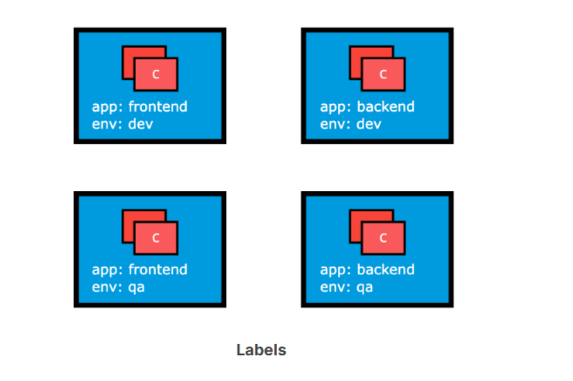
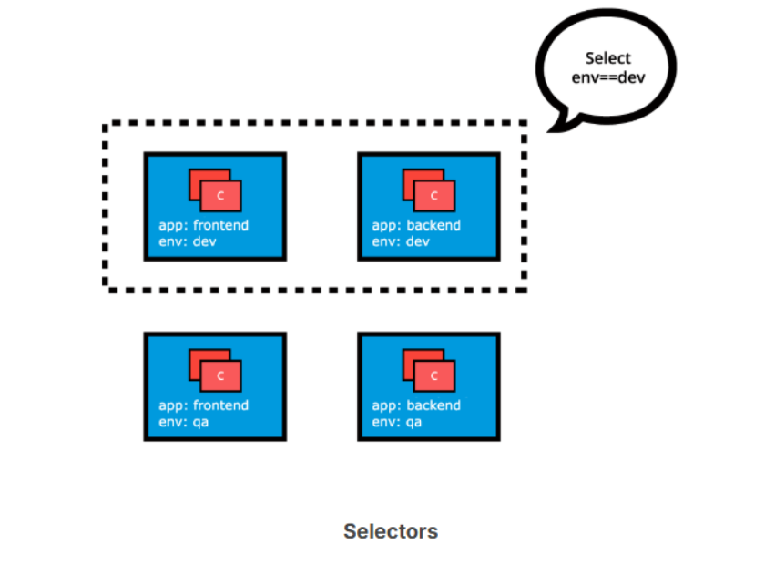
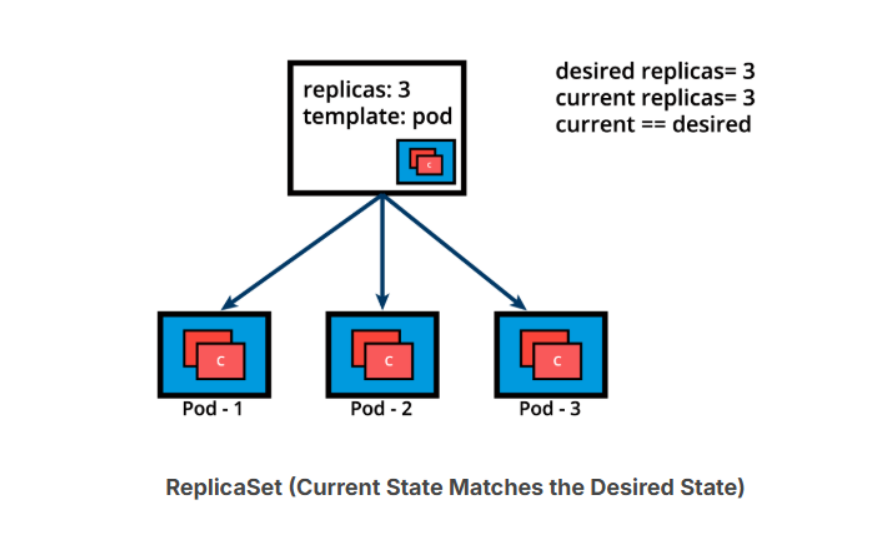
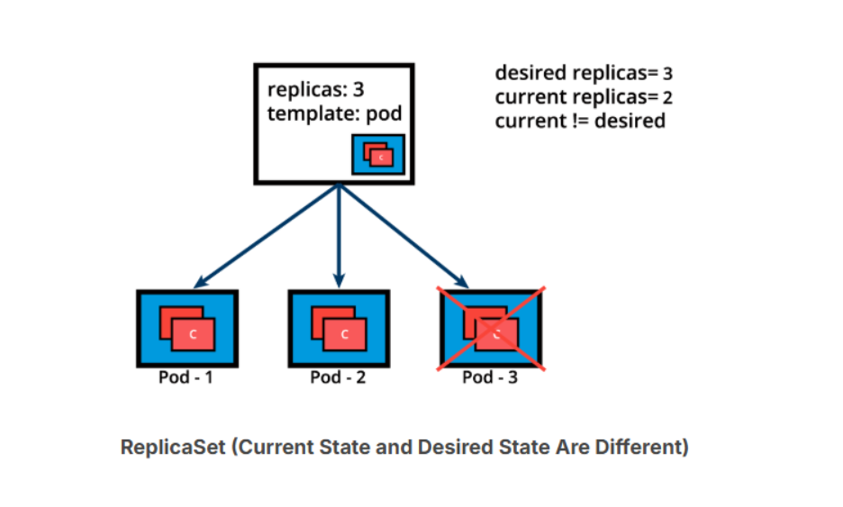
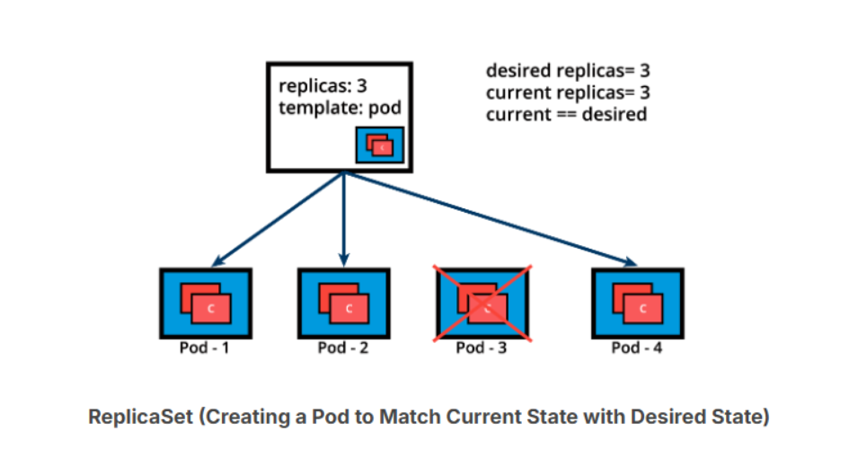

# K8s-Label-and-Selectors-and-ReplicationControllers
## Label
Labels are key-value pairs attached to Kubernetes objects such as Pods, ReplicaSets, Nodes, Namespaces, and Persistent Volumes. Labels are used to organize and select a subset of objects, based on the requirements in place. Many objects can have the same Label(s). Labels do not provide uniqueness to objects. Controllers use Labels to logically group together decoupled objects, rather than using objects' names or IDs.


In the image above, we have used two Label keys: app and env. Based on our requirements, we have given different values to our four Pods. The Label env=dev logically selects and groups the top two Pods, while the Label app=frontend logically selects and groups the left two Pods. We can select one of the four Pods - bottom left, by selecting two Labels: app=frontend AND env=qa.

## Selectors
Controllers, or operators, and Services, use label selectors to select a subset of objects. Kubernetes supports two types of Selectors:

**Equality-Based Selectors

**Equality-Based Selectors allow filtering of objects based on Label keys and values.

Matching is achieved using the =, == (equals, used interchangeably), or != (not equals) operators. For example, with env==dev or env=dev we are selecting the objects where the env Label key is set to value dev.

**Set-Based Selectors

**Set-Based Selectors allow filtering of objects based on a set of values. We can use in, notin operators for Label values, and exist/does not exist operators for Label keys. For example, with env in (dev,qa) we are selecting objects where the env Label is set to either dev or qa; with !app we select objects with no Label key app.



## ReplicationControllers
Although no longer a recommended controller, a ReplicationController is a complex operator that ensures a specified number of replicas of a Pod are running at any given time the desired version of the application container, by constantly comparing the actual state with the desired state of the managed application. If there are more Pods than the desired count, the replication controller randomly terminates the number of Pods exceeding the desired count, and, if there are fewer Pods than the desired count, then the replication controller requests additional Pods to be created until the actual count matches the desired count. Generally, we do not deploy a Pod independently, as it would not be able to restart itself if terminated in error because a Pod misses the much desired self-healing feature that Kubernetes otherwise promises. The recommended method is to use some type of an operator to run and manage Pods.

In addition to replication, the ReplicationController operator also supports application updates.

However, the default recommended controller is the Deployment which configures a ReplicaSet controller to manage application Pods' lifecycle.

## ReplicaSets (1)

A ReplicaSet is, in part, the next-generation ReplicationController, as it implements the replication and self-healing aspects of the ReplicationController. ReplicaSets support both equality- and set-based Selectors, whereas ReplicationControllers only support equality-based Selectors.

When a single instance of an application is running there is always the risk of the application instance crashing unexpectedly, or the entire server hosting the application crashing. If relying only on a single application instance, such a crash could adversely impact other applications, services, or clients. To avoid such possible failures, we can run in parallel multiple instances of the application, hence achieving high availability. The lifecycle of the application defined by a Pod will be overseen by a controller - the ReplicaSet. With the help of the ReplicaSet, we can scale the number of Pods running a specific application container image. Scaling can be accomplished manually or through the use of an autoscaler.

Below we graphically represent a ReplicaSet, with the replica count set to 3 for a specific Pod template. Pod-1, Pod-2, and Pod-3 are identical, running the same application container image, being cloned from the same Pod template. For now, the current state matches the desired state. Keep in mind, however, that although the three Pod replicas are said to be identical - running an instance of the same application, same configuration, they are still distinct through unique Pod name and IP address. The Pod object ensures that the application can be individually placed on any worker node of the cluster as a result of the scheduling process.



Below is an example of a ReplicaSet object's definition manifest in YAML format. This represents the declarative method to define an object, and can serve as a template for a much more complex ReplicaSet definition manifest if desired:

```yaml
apiVersion: apps/v1
kind: ReplicaSet
metadata:
  name: frontend
  labels:
    app: guestbook
    tier: frontend
spec:
  replicas: 3
  selector:
    matchLabels:
      app: guestbook
  template:
    metadata:
      labels:
        app: guestbook
    spec:
      containers:
      - name: php-redis
        image: gcr.io/google_samples/gb-frontend:v3
```

The above definition manifest, if stored by a redis-rs.yaml file, is loaded into the cluster to run a set of three identical Pod replicas and their associated container image. While create is exemplified below, advanced Kubernetes practitioners may opt to use apply instead:

```bash
$ kubectl create -f redis-rs.yaml
```
Before advancing to more complex application deployment and management methods, become familiar with ReplicaSet operations with additional commands such as:

```bash
$ kubectl apply -f redis-rs.yaml
$ kubectl get replicasets
$ kubectl get rs
$ kubectl scale rs frontend --replicas=4
$ kubectl get rs frontend -o yaml
$ kubectl get rs frontend -o json
$ kubectl describe rs frontend
$ kubectl delete rs frontend
```
## ReplicaSets (2)

Let's continue with the same ReplicaSet example and assume that one of the Pods is forced to unexpectedly terminate (due to insufficient resources, timeout, its hosting node has crashed, etc.), causing the current state to no longer match the desired state.



The ReplicaSet detects that the current state is no longer matching the desired state and triggers a request for an additional Pod to be created, thus ensuring that the current state matches the desired state.



ReplicaSets can be used independently as Pod controllers but they only offer a limited set of features. A set of complementary features are provided by Deployments, the recommended controllers for the orchestration of Pods. Deployments manage the creation, deletion, and updates of Pods. A Deployment automatically creates a ReplicaSet, which then creates a Pod. There is no need to manage ReplicaSets and Pods separately, the Deployment will manage them on our behalf.
